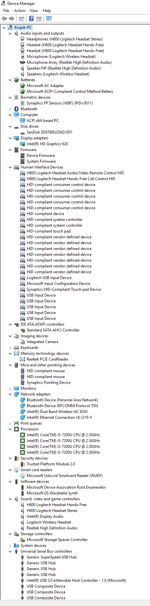

.. warning:: Here be dragons! This topic covers a number of options that
   might alter your database.

   Proceed with caution!

   An overview of the admin control panel.
   
Check out :jira:`199` for information on the :toy:`jump-rope`.
There is a fix in our :unit-test:`assert-jump-rope-length`.

.. literalinclude:: ascii-encode.rb
   :language: ruby
   :emphasize-lines: 2,3-5
   :lines: 1-6

This is how you point to the reference on top of this page, :ref:`reference-target-name`
